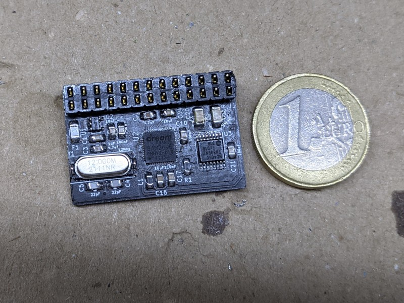

# DWAVE: Dream Wavetable module

## Introduction

The DWAVE is a small General MIDI Synth based on the SAM2695 chip. It can be plugged on the wavetable header of your sound card.

### Disclaimer

I take NO responsibility for what happens if you decide to build and use this card. Your computer might crash, catch fire or be destroyed in other nasty ways.
You're encourauged to take what you deem fit from this, and use it in your projects!

## Bill of Materials

| Component         | Qty | Type / Value        | Mouser code           |
| ----------------- | --- | ------------------- | --------------------- |
| C1                | 2   | 1uF / 0805          | [710-885012207022](https://www.mouser.it/ProductDetail/710-885012207022) |
| C2                | 1   | 10nF / 0805         | [710-885382207006](https://www.mouser.it/ProductDetail/710-885382207006) |
| C3,C7             | 2   | 4.7uF / 0805        | [187-CL21A475KPFNNNG](https://www.mouser.it/ProductDetail/187-CL21A475KPFNNNG) |
| C4,C5             | 2   | 22pF / 0805         | [710-885012007053](https://www.mouser.it/ProductDetail/710-885012007053) |
| C6,C8,C9,C10,C15,C17,C21 | 7   | 100nF / 0805        | [710-885012207072](https://www.mouser.it/ProductDetail/710-885012207072) |
| C14,C16,C18       | 3   | 10uF / 0805         | [187-CL21A106KPFNNNG](https://www.mouser.it/ProductDetail/187-CL21A106KPFNNNG) |
| C19,C20           | 2   | 100uF / 1206        | [81-GRM31CR61A107ME5L](https://www.mouser.it/ProductDetail/81-GRM31CR61A107ME5L) |
| L1                | 1 (or 2)  | Inductor 742792093  | [710-742792093](https://www.mouser.it/ProductDetail/710-742792093) |
| R1                | 1 (or 0)  | 0 ohm or same as L1 | [71-CRCW08050000Z0EAC](https://www.mouser.it/ProductDetail/71-CRCW08050000Z0EAC) |
| R3,R4             | 2   | 47k / 0805          | [652-CR0805FX-4702ELF](https://www.mouser.it/ProductDetail/652-CR0805FX-4702ELF) |
| F1                | 1   | SMD Fuse            | [652-SF-1206HI050M-2](https://www.mouser.it/ProductDetail/652-SF-1206HI050M-2) |
| Y1                | 1   | 12Mhz / HC49        | [449-LFXTAL035293REEL](https://www.mouser.it/ProductDetail/449-LFXTAL035293REEL) |
| U1                | 1   | LP2085-3.3          | [926-LP2985IM5X33NOPB](https://www.mouser.it/ProductDetail/926-LP2985IM5X33NOPB) |
| U2                | 1   | SAM2695             | |
| U3                | 1   | 74HC4050            | [771-74HC4050PW-Q100J](https://www.mouser.it/ProductDetail/771-74HC4050PW-Q100J) |
| J1                | 1   | 2x13 2.54mm socket  | [200-SSQ11301GD](https://www.mouser.it/ProductDetail/Samtec/SSQ-113-01-G-D), but any snappable 2.54mm socket is fine |

## Credits

Thanks to [Sergey Kiselev](https://github.com/skiselev) for his symbol/footprint library!

